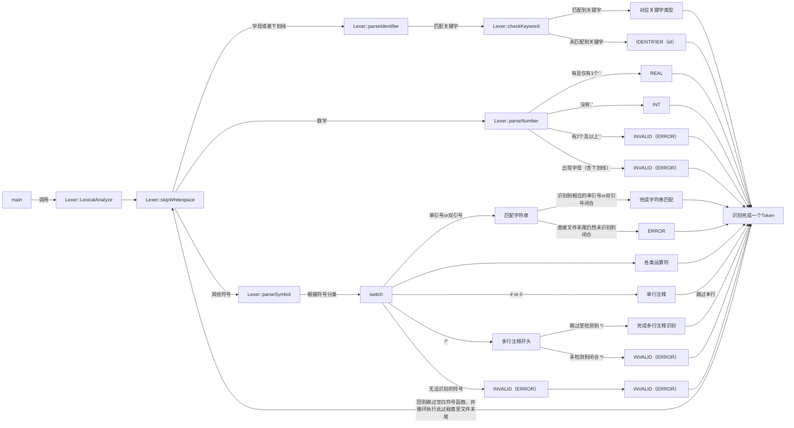

# LiteCompiler_C++

## 文件结构

```
├── LiteCompiler_C++                整个项目文件夹
│   ├── .idea                       CLion配置文件
│   ├── CMakeLists.txt              CMake配置文件
│   ├── main.cpp                    主函数
│   └── src                         存放所有头文件和源文件
│       ├── debug                   调试文件
│       │   ├── debug.cpp           debug类相关成员函数及变量定义
│       │   └── debug.h             debug类声明文件
|       ├── error                   错误处理
|       │   ├── error.cpp           错误处理函数定义
|       │   └── error.h             错误处理函数声明
│       ├── FileHandler             文件处理【主要为对文件进行输入输出】
│       │   ├── FileHandler.cpp     文件处理类相关成员函数及变量定义
│       │   └── FileHandler.h       文件处理类声明
│       ├── LexicalAnalysis         词法分析器
│       │   ├── Lexer.cpp           词法分析器类相关成员函数及变量定义
│       │   └── Lexer.h             词法分析器类声明
│       └── Token                   Token相关文件
│           ├── Token.cpp           KEYWORD定义、Token类相关成员函数及变量定义
│           └── Token.h             TokenType枚举类型声明、Token类声明
└── README.md                       项目介绍【本文件】

```

## 构建方法🛠️

构建平台：Linux或Window10及以上

### 方法一：（推荐使用）

要求：安装[CLion](https://www.jetbrains.com/clion/)（可以使用学校邮箱注册官方正版）

步骤：使用CLion打开LiteCompiler_C++文件夹运行该项目

### 方法二：

要求：安装[CMake](https://cmake.org/)和C编译器工具链（例如`gcc, g++, make, gdb`等，在Windows平台上推荐使用[msys2](https://code.visualstudio.com/docs/cpp/config-mingw#_installing-the-mingww64-toolchain))，**项目路径上不能有中文**

#### Windows平台（这里以使用gnu工具链为例）[^1]：

步骤：进入LiteCompiler_C++文件夹，运行以下四条命令

```sh
mkdir build
```

```sh
cd build
```

```sh
cmake -G "MinGW Makefiles" ..
```

```sh
mingw32-make        #mingw32-make是msys2中的make工具
```

build文件夹内会生成目标：`LiteCompiler_C++.exe`

#### Linux平台：

步骤：进入LiteCompiler_C++文件夹，运行这条命令

```sh
mkdir build && cd build && cmake .. && make
```

build文件夹内会生成目标：`LiteCompiler_C++`

## 词法分析器

这里列出的关键字和符号主要用于描述编程语言中的词法单元（Lexical Units）或标记（Tokens），在语法解析和编译过程中具有特定的意义。下面是对这些关键字和符号的简要介绍：

1. **关键字（Keywords）**：
   - `KEYWORD_AND`: `and`表示逻辑与操作，通常用于布尔表达式中。
   - `KEYWORD_BREAK`: `break`，用于跳出循环或switch语句。
   - `KEYWORD_CHAR`:  `char`，字符类型关键字。
   - `KEYWORD_CLASS`: `class`，表示定义类的关键字。
   - `KEYWORD_CONTINUE`: `continue`，继续下一次循环的关键字。
   - `KEYWORD_DO`:  `do`，循环语句关键字。
   - `KEYWORD_DOUBLE`: `double`，浮点数类型关键字。
   - `KEYWORD_ELSE`: `else`，条件语句中的否定分支关键字。
   - `KEYWORD_EOF`:  `EOF`或`eof`，表示输入结束的关键字。
   - `KEYWORD_FALSE`: `false`，布尔类型的假值关键字。
   - `KEYWORD_FOR`: `for`，循环语句中的关键字。
   - `KEYWORD_FUNCTION`: `function`，定义函数的关键字。
   - `KEYWORD_IF`: `if`，条件语句中的条件判断关键字。
   - `KEYWORD_INTEGER`: `integer`，整数类型关键字。
   - `KEYWORD_NIL`: `nil`，空值关键字，表示空对象或未定义的值。
   - `KEYWORD_NOT`: `not`表示逻辑非操作。
   - `KEYWORD_NULL`:  `null`，空指针。
   - `KEYWORD_OR`: `or`表示逻辑或操作。
   - `KEYWORD_PRINT`: `print`，输出语句的关键字。
   - `KEYWORD_READ`:  `read`，读操作关键字。
   - `KEYWORD_REPEAT`:  `repeat`，循环关键字。
   - `KEYWORD_RETURN`: `return`，函数返回语句的关键字。
   - `KEYWORD_SUPER`: `super`，表示父类的关键字。
   - `KEYWORD_THIS`: `this`，表示当前对象或实例的关键字。
   - `KEYWORD_TRUE`: `true`，布尔类型的真值关键字。
   - `KEYWORD_UNTIL`: `until`，循环关键字。
   - `KEYWORD_VAR`: `var`，定义变量的关键字。
   - `KEYWORD_WHILE`: `while`，循环语句中的关键字。
   - `KEYWORD_WRITE`:  `write`，写操作关键字。
2. **符号（Symbols）**：
   - `ASSIGNMENT`: `=`赋值运算符。
   - `PLUS`: `+`，加号。
   - `PLUS_FORWARD`: `+=`，加等于号。
   - `MINUS`: `-`，减号。
   - `MINUS_FORWARD`: `-=`，减等于号。
   - `MULTIPLY`: `*`，乘号。
   - `MULTIPLY_FORWARD`: `*=`，乘等于号。
   - `DIVIDE`: `/`，除号。
   - `DIVIDE_FORWARD`: `/=`，除等于号。
   - `AND`: `&`，按位与运算符。
   - `AND_FORWARD`: `&=`，按位与赋值运算符。
   - `LOGICAL_AND`: `&&`，逻辑与运算符。
   - `OR`: `|`，按位或运算符。
   - `OR_FORWARD`: `|=`，按位或赋值运算符。
   - `LOGICAL_OR`: `||`，逻辑或运算符。
   - `XOR`: `^`，按位异或运算符。
   - `XOR_FORWARD`: `^=`，按位异或赋值运算符。
   - `NOT`: `~`，按位取反运算符。
   - `LOGICAL_NOT`: `!`，逻辑非运算符。
   - `NOT_EQUAL`: `!=`，不等于运算符。
   - `EQUAL`: `==`，等于运算符。
   - `ABOVE`: `>`，大于运算符。
   - `BELOW`: `<`，小于运算符。
   - `ABOVE_OR_EUQAL`: `>=`，大于等于运算符。
   - `BELOW_OR_EUQAL`: `<=`，小于等于运算符。
   - `LEFT_PAREN`: `(`，左括号。
   - `RIGHT_PAREN`: `)`，右括号。
   - `LEFT_BRACKET`: `[`，左方括号。
   - `RIGHT_BRACKET`: `]`，右方括号。
   - `LEFT_BRACE`: `{`，左花括号。
   - `RIGHT_BRACE`: `}`，右花括号。
   - `D_MARKS`: `"`，双引号。
   - `S_MARKS`: `'`，单引号。
   - `MEMBER`: `.`，成员访问符。
   - `MEMBER_PTR`: `->`，成员指针访问符。
   - `COMMA`: `,`，逗号。
   
3. **其他（Else）**：
   - `IDENTIFIER`: 标识符字面量，用于表示变量名、函数名等。
   - `INTEGER`, `FLOAT`: 整数和浮点数类型变量。
   - `STRING`: 字符串类型变量。
   - `EMPTY`: 空标记。
   - `INVALID`: 非法的标记，表示词法错误。
   - `EOF`: 表示已经到达代码文件的末尾。

这些关键字和符号是编程语言中常见的词法单元，通过它们可以构建出语法结构，并进行语法分析、编译和执行代码。


词法分析器算法结构图如下：



[^1]: 对于其他工具链，命令三和命令四会有所不同。可能可以使用默认的设置，直接运行`cmake ..`和`make`，也可能要更改命令，手动指定使用的编译器和make工具

