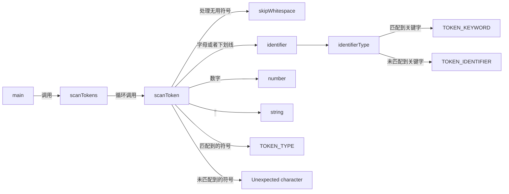

# LiteCompiler

## 文件结构

```
├── Crobin							项目文件夹
│   ├── CMakeLists.txt				cmake文件
│   ├── main.c						主函数
│   └── src							存放所有头文件和源文件
│       ├── common.h				存放常用的宏定义和数据
│       ├── debug					debug文件
│       │   ├── debug.c				debug函数
│       │   └── debug.h				debug头文件
│       ├── memory					内存分配相关
│       │   ├── memory.c			存放内存分配宏定义
│       │   └── memory.h			存放内存分配函数
│       ├── scanner					词法分析器
│       │   ├── scanner.c			词法分析器源代码
│       │   └── scanner.h			词法分析器头文件
│       └── token					token相关
│           ├── token.c				tokenType定义和token相关函数声明
│           └── token.h				token相关函数
└── README.md						本文件

```

## 构建方法

构建平台：linux或window10及以上

#### 方法一：

要求：安装[clion](https://www.jetbrains.com/clion/)

步骤：使用clion打开Crobin文件夹运行该项目

#### 方法二：

要求：安装[cmake](https://cmake.org/)

步骤：进入Crobin文件夹，运行以下三条命令

```sh
mkdir build
```

```sh
cd build
```

```sh
../cmake
```

build文件夹内会生成目标：`Crobin`

## 词法分析器

这里列出的关键字和符号主要用于描述编程语言中的词法单元（Lexical Units）或标记（Tokens），在语法解析和编译过程中具有特定的意义。下面是对这些关键字和符号的简要介绍：

1. **关键字（Keywords）**：
   - `TOKEN_AND`: `and`或者`&&`，逻辑与运算符，表示逻辑与操作，通常用于布尔表达式中。
   - `TOKEN_BREAK`: `break`，用于跳出循环或switch语句。
   - `TOKEN_CLASS`: `class`，表示定义类的关键字。
   - `TOKEN_CONTINUE`: `continue`，继续下一次循环的关键字。
   - `TOKEN_DOUBLE`: `double`，浮点数类型关键字。
   - `TOKEN_ELSE`: `else`，条件语句中的否定分支关键字。
   - `TOKEN_FALSE`: `false`，布尔类型的假值关键字。
   - `TOKEN_FOR`: `for`，循环语句中的关键字。
   - `TOKEN_FUNCTION`: `function`，定义函数的关键字。
   - `TOKEN_IF`: `if`，条件语句中的条件判断关键字。
   - `TOKEN_INTEGER`: `integer`，整数类型关键字。
   - `TOKEN_NIL`: `nil`，空值关键字，表示空对象或未定义的值。
   - `TOKEN_NOT`: `not`和`!`，逻辑非运算符，表示逻辑非操作。
   - `TOKEN_OR`: `or`和`||`，逻辑或运算符，表示逻辑或操作。
   - `TOKEN_PRINT`: `print`，输出语句的关键字。
   - `TOKEN_RETURN`: `return`，函数返回语句的关键字。
   - `TOKEN_SUPER`: `super`，表示父类的关键字。
   - `TOKEN_THIS`: `this`，表示当前对象或实例的关键字。
   - `TOKEN_TRUE`: `true`，布尔类型的真值关键字。
   - `TOKEN_VAR`: `var`，定义变量的关键字。
   - `TOKEN_WHILE`: `while`，循环语句中的关键字。
2. **符号（Symbols）**：
   - `TOKEN_LEFT_PAREN`, `TOKEN_RIGHT_PAREN`: 左右括号`(`和`)`，用于表示代码中的分组或函数调用。
   - `TOKEN_LEFT_BRACE`, `TOKEN_RIGHT_BRACE`: 左右花括号`{`和`}`，表示代码块的开始和结束。
   - `TOKEN_LEFT_BRACKET`, `TOKEN_RIGHT_BRACKET`: 左右方括号`[`和`]`，用于数组下标访问等。
   - `TOKEN_COMMA`: 逗号`,`，用于分隔函数参数或数组元素等。
   - `TOKEN_DOT`: 点`.`，用于访问对象的属性或方法。
   - `TOKEN_MINUS`, `TOKEN_PLUS`: 减号`-`和加号`+`，用于数学运算。
   - `TOKEN_SEMICOLON`: 分号`;`，用于表示语句的结束。
   - `TOKEN_SLASH`, `TOKEN_STAR`, `TOKEN_MOD`: 斜杠`/`、星号`*`、百分号`%`，用于表示除法、乘法、取模等操作。
   - `TOKEN_EQUAL`: 等号`=`，用于赋值操作。
   - `TOKEN_NOT_EQUAL`, `TOKEN_EQUAL_EQUAL`: 不等号`!=`、双等号`==`，用于比较操作。
   - `TOKEN_GREATER`, `TOKEN_GREATER_EQUAL`: 大于号`>`、大于等于号`>=`，用于比较操作。
   - `TOKEN_LESS`, `TOKEN_LESS_EQUAL`: 小于号`<`、小于等于号`<=`，用于比较操作。
3.  **其他（Else）**：
   - `TOKEN_IDENTIFIER`: 标识符字面量，用于表示变量名、函数名等。
   - `TOKEN_STRING`: 字符串字面量。
   - `TOKEN_INT`, `TOKEN_REAL`: 整数和浮点数字面量。
   - `TOKEN_ERROR`: 表示词法分析或解析过程中的错误。
   - `TOKEN_EOF`: 表示已经到达代码文件的末尾。

这些关键字和符号是编程语言中常见的词法单元，通过它们可以构建出语法结构，并进行语法分析、编译和执行代码。


词法分析器结构图如下：



