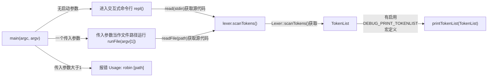
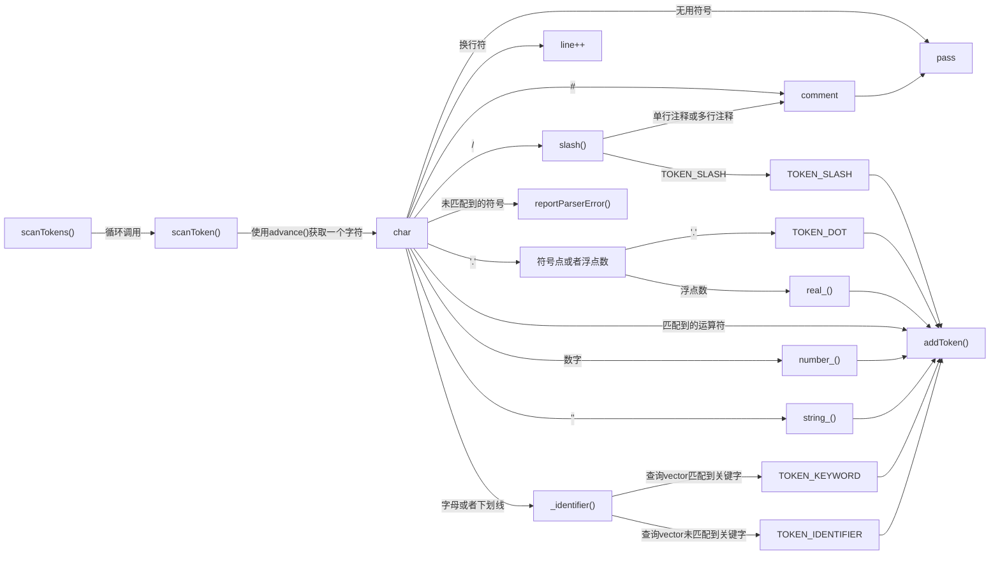

# LiteCompiler

## 文件结构

```
└── robin                           项目文件夹
    ├── CMakeLists.txt              cmake文件
    ├── main.cpp                    主函数
    ├── README.md                   本文件
    └── src                         源代码
        ├── common.h                一些项目用到的宏定义和头文件
        ├── debug                   debug文件
        │   ├── debug.cpp           debug函数实现
        │   └── debug.h             debug函数声明
        ├── reportParserError                   编译器错误处理模块
        │   ├── reportParserError.cpp           error函数定义
        │   └── reportParserError.h             error函数声明
        ├── parser                  语法分析器
        │   ├── parser.cpp          语法分析器parser函数实现
        │   └── parser.h            语法分析器parser类声明
        ├── ast                     语法树相关类的定义
        │   ├── production.h        语法树中产生式的类
        │   ├── initAst.h           初始化ast目录下面的一些类的静态成员
        │   ├── symbol.h            存放符号相关定义（用于符号栈）
        │   └── type.h              区分标识符和字面值具体类型的类（弃用）
        ├── lexer                   词法分析器
        │   ├── lexer.cpp           词法分析器lexer函数实现
        │   └── lexer.h             词法分析器lexer类声明
        └── token                   token相关
            ├── token.cpp           token类函数实现
            └── token.h             tokenType定义和token类声明
```

## 构建方法

构建平台：linux或window10及以上

### 方法一：（推荐使用）

要求：安装[clion](https://www.jetbrains.com/clion/)（可以使用学校邮箱注册官方正版）

步骤：使用clion打开Crobin文件夹运行该项目

### 方法二：

要求：安装[cmake](https://cmake.org/)和c编译器工具链（例如gcc,g++,make,gdb等，在windows平台上推荐使用[msys2](https://code.visualstudio.com/docs/cpp/config-mingw#_installing-the-mingww64-toolchain))，**项目路径上不能有中文**

#### windows平台（这里以使用gnu工具链为例）[^1]：

步骤：进入robin文件夹，运行以下四条命令

```sh
mkdir build
```

```sh
cd build
```

```sh
cmake -G "MinGW Makefiles" ..
```

```sh
mingw32-make        #mingw32-make是msys2中的make工具
```

build文件夹内会生成目标：`Crobin.exe`

#### linux平台：

步骤：进入Crobin文件夹，运行这条命令

```sh
mkdir build && cd build && cmake .. && make
```

build文件夹内会生成目标：`Crobin`

## 词法分析器

这里列出的关键字和符号主要用于描述编程语言中的词法单元（Lexical Units）或标记（Tokens），在语法解析和编译过程中具有特定的意义。下面是对这些关键字和符号的简要介绍：

1. **关键字（Keywords）**：
   - `TOKEN_AND`: `and`或者`&&`，逻辑与运算符，表示逻辑与操作，通常用于布尔表达式中。
   - `TOKEN_BREAK`: `break`，用于跳出循环或switch语句。
   - `TOKEN_CLASS`: `class`，表示定义类的关键字。**（保留字，未实现）**
   - `TOKEN_CONTINUE`: `continue`，继续下一次循环的关键字。
   - `TOKEN_DO`:`do`，未定义的关键字**（保留字，未实现）**
   - `TOKEN_DOUBLE`: `double`，浮点数类型关键字。
   - `TOKEN_ELSE`: `else`，条件语句中的否定分支关键字。
   - `TOKEN_FALSE`: `false`，布尔类型的假值关键字。
   - `TOKEN_FOR`: `for`，循环语句中的关键字。**（保留字，未实现）**
   - `TOKEN_FUNCTION`: `function`，定义函数的关键字。
   - `TOKEN_IF`: `if`，条件语句中的条件判断关键字。
   - `TOKEN_INTEGER`: `integer`，整数类型关键字。
   - `TOKEN_NIL`: `nil`，空值关键字，表示空对象或未定义的值。
   - `TOKEN_NOT`: `not`和`!`，逻辑非运算符，表示逻辑非操作。
   - `TOKEN_OR`: `or`和`||`，逻辑或运算符，表示逻辑或操作。
   - `TOKEN_PRINT`: `print`，输出语句的关键字。
   - `TOKEN_READ`:`read`，未定义的关键字
   - `TOKEN_REPEAT`:`repeat`，未定义的关键字
   - `TOKEN_RETURN`: `return`，函数返回语句的关键字。
   - `TOKEN_SUPER`: `super`，表示父类的关键字。**（保留字，未实现）**
   - `TOKEN_THIS`: `this`，表示当前对象或实例的关键字。**（保留字，未实现）**
   - `TOKEN_TRUE`: `true`，布尔类型的真值关键字。
   - `TOKEN_UNTIL`:`until`，未定义的关键字
   - `TOKEN_VAR`: `var`，定义变量的关键字。
   - `TOKEN_WHILE`: `while`，循环语句中的关键字。
   - `TOKEN_WRITE`:`write`，未定义的关键字
2. **符号（Symbols）**：
   - `TOKEN_LEFT_PAREN`, `TOKEN_RIGHT_PAREN`: 左右括号`(`和`)`，用于表示代码中的分组或函数调用。
   - `TOKEN_LEFT_BRACE`, `TOKEN_RIGHT_BRACE`: 左右花括号`{`和`}`，表示代码块的开始和结束。
   - `TOKEN_LEFT_BRACKET`, `TOKEN_RIGHT_BRACKET`: 左右方括号`[`和`]`，用于数组下标访问等。
   - `TOKEN_COMMA`: 逗号`,`，用于分隔函数参数或数组元素等。
   - `TOKEN_DOT`: 点`.`，用于访问对象的属性或方法。
   - `TOKEN_MINUS`, `TOKEN_PLUS`: 减号`-`和加号`+`，用于数学运算。
   - `TOKEN_SEMICOLON`: 分号`;`，用于表示语句的结束。
   - `TOKEN_SLASH`, `TOKEN_STAR`, `TOKEN_MOD`: 斜杠`/`、星号`*`、百分号`%`，用于表示除法、乘法、取模等操作。
   - `TOKEN_EQUAL`: 等号`=`，用于赋值操作。
   - `TOKEN_NOT_EQUAL`, `TOKEN_EQUAL_EQUAL`: 不等号`!=`、双等号`==`，用于比较操作。
   - `TOKEN_GREATER`, `TOKEN_GREATER_EQUAL`: 大于号`>`、大于等于号`>=`，用于比较操作。
   - `TOKEN_LESS`, `TOKEN_LESS_EQUAL`: 小于号`<`、小于等于号`<=`，用于比较操作。
   - `TOKEN_DOUBLE_ADD`:自增运算符`++`，用于表示自增操作。
   - `TOKEN_DOUBLE_MINUS`:自减运算符`--`，用于表示自减操作。
3.  **其他（Else）**：
   - `TOKEN_IDENTIFIER`: 标识符字面量，用于表示变量名、函数名等。
   - `TOKEN_STRING`: 字符串字面量。
   - `TOKEN_INT`, `TOKEN_REAL`: 整数和浮点数字面量。
   - `TOKEN_BOOL_`:布尔字面量，为`true`或`false`
   - `TOKEN_EOF`: 表示已经到达代码文件的末尾。

这些关键字和符号是编程语言中常见的词法单元，通过它们可以构建出语法结构，并进行语法分析、编译和执行代码。

主函数结构如下：



词法分析器结构图如下：



[^1]: 对于其他工具链，命令三和命令四会有所不同。可能可以使用默认的设置，直接运行`cmake ..`和`make`，也可能要更改命令，手动指定使用的编译器和make工具

